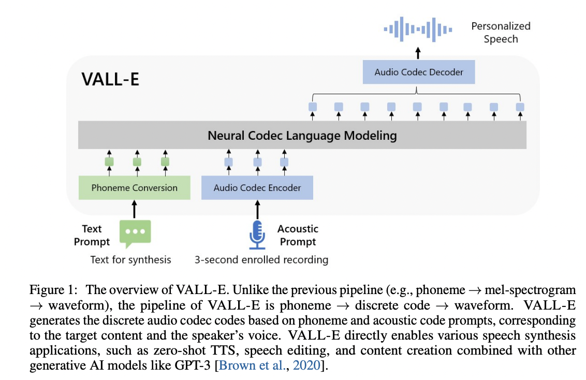

<p align="center">
</img>
</p>

# VALL-E

An unofficial PyTorch implementation of [VALL-E](https://valle-demo.github.io/), based on the [EnCodec](https://github.com/facebookresearch/encodec) tokenizer.

[](https://www.buymeacoffee.com/enhuiz)

## Get Started

> A toy Google Colab example: [](https://colab.research.google.com/drive/1wEze0kQ0gt9B3bQmmbtbSXCoCTpq5vg-?usp=sharing).
> Please note that this example overfits a single utterance under the `data/test` and is not usable.
> The pretrained model is yet to come. 

### Requirements

Since the trainer is based on [DeepSpeed](https://github.com/microsoft/DeepSpeed#requirements), you will need to have a GPU that DeepSpeed has developed and tested against, as well as a CUDA or ROCm compiler pre-installed to install this package.

### Install

```
pip install git+https://github.com/enhuiz/vall-e
```

Or you may clone by:

```
git clone --recurse-submodules https://github.com/enhuiz/vall-e.git
```

Note that the code is only tested under `Python 3.10.7`.

### Train

1. Put your data into a folder, e.g. `data/your_data`. Audio files should be named with the suffix `.wav` and text files with `.normalized.txt`.

2. Quantize the data:

```
python -m vall_e.emb.qnt data/your_data
```

3. Generate phonemes based on the text:

```
python -m vall_e.emb.g2p data/your_data
```

4. Customize your configuration by creating `config/your_data/ar.yml` and `config/your_data/nar.yml`. Refer to the example configs in `config/test` and `vall_e/config.py` for details. You may choose different model presets, check `vall_e/vall_e/__init__.py`.

5. Train the AR or NAR model using the following scripts:

```
python -m vall_e.train yaml=config/your_data/ar_or_nar.yml
```

You may quit your training any time by just typing `quit` in your CLI. The latest checkpoint will be automatically saved.

### Export

Both trained models need to be exported to a certain path. To export either of them, run:

```
python -m vall_e.export zoo/ar_or_nar.pt yaml=config/your_data/ar_or_nar.yml
```

This will export the latest checkpoint.

### Synthesis

```
python -m vall_e <text> <ref_path> <out_path> --ar-ckpt zoo/ar.pt --nar-ckpt zoo/nar.pt
```

## TODO

- [x] AR model for the first quantizer
- [x] Audio decoding from tokens
- [x] NAR model for the rest quantizers
- [x] Trainers for both models
- [x] Implement AdaLN for NAR model.
- [x] Sample-wise quantization level sampling for NAR training.
- [ ] Pre-trained checkpoint and demos on LibriTTS
- [x] Synthesis CLI

## Notice

- [EnCodec](https://github.com/facebookresearch/encodec) is licensed under CC-BY-NC 4.0. If you use the code to generate audio quantization or perform decoding, it is important to adhere to the terms of their license.

## Citations

```bibtex
@article{wang2023neural,
  title={Neural Codec Language Models are Zero-Shot Text to Speech Synthesizers},
  author={Wang, Chengyi and Chen, Sanyuan and Wu, Yu and Zhang, Ziqiang and Zhou, Long and Liu, Shujie and Chen, Zhuo and Liu, Yanqing and Wang, Huaming and Li, Jinyu and others},
  journal={arXiv preprint arXiv:2301.02111},
  year={2023}
}
```

```bibtex
@article{defossez2022highfi,
  title={High Fidelity Neural Audio Compression},
  author={Défossez, Alexandre and Copet, Jade and Synnaeve, Gabriel and Adi, Yossi},
  journal={arXiv preprint arXiv:2210.13438},
  year={2022}
}
```
